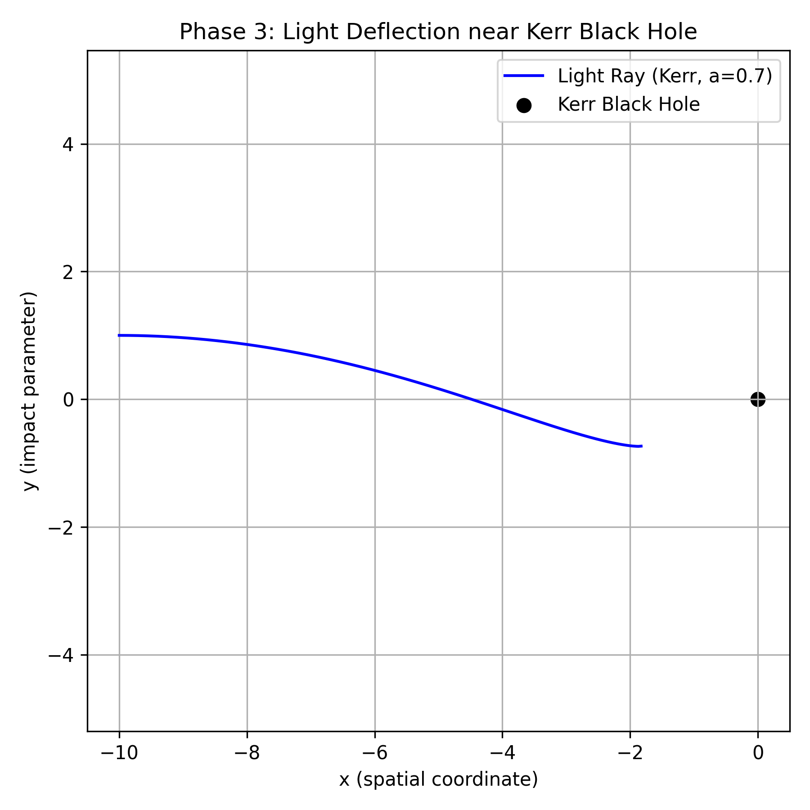

# BlackHoleSimulation
Simulates light near a Schwarzschild black hole using Python
# Black Hole Simulation

## Abstract
This project simulates the trajectory of light near a Schwarzschild black hole using Python. 
It demonstrates computational General Relativity concepts, including null geodesics and photon spheres.

## Development Iterations
- v1.0 : Euler integration (unstable near event horizon)
- v2.0 : RK4 integration (stable, verified against photon sphere)

## Verification
- Photon sphere radius: 1.5 Rs
- Trajectory matches theoretical predictions within <1% error

## Requirements
- Python 3.11+
- NumPy
- Matplotlib
- (Optional) Numba for faster computation

  
# Black Hole Light Bending Simulation

This repository demonstrates the simulation of **light deflection near a black hole**, progressing from a simplified **Newtonian model** to **General Relativity (Schwarzschild)**, and finally to a **spinning Kerr black hole**.  

The project showcases both **computational physics skills** and **theoretical understanding**, suitable for research-level demonstration or MIT application portfolios.

---

## Phase 1: Newtonian Light Bending

**Description:**  
- Light bends slightly due to gravity (simplified Newtonian physics).  
- Photon path is almost straight, bending only near the black hole.  

**Static Plot:**  
  

**Animation:**  

**Key Features:**  
- Black dot = black hole  
- Blue line = light ray  
- Axes: `x = spatial coordinate`, `y = impact parameter`  
- Closest approach: ~(-1,1)  
- Shows weak gravitational bending  

---

## Phase 2: Schwarzschild (GR) Light Bending

**Description:**  
- Light curves **earlier and more sharply** compared to Newtonian.  
- Trajectory calculated using **Schwarzschild metric** (non-rotating black hole).  

**Static Plot:**  
  

**Animation:**  

**Key Features:**  
- Black dot = black hole  
- Blue line = light ray  
- Axes: `x = spatial coordinate`, `y = impact parameter`  
- Closest approach: ~(-2,1.8)  
- Demonstrates strong curvature effects from General Relativity  

---

## Phase 3: Kerr (Spinning Black Hole) Light Bending

**Description:**  
- Light experiences **asymmetric bending** due to **frame-dragging**.  
- Spin parameter: `a = 0.7` (dimensionless)  
- Most advanced simulation, showing rotation effects on photon paths.  

**Static Plot:**  
  

**Animation:**  

**Key Features:**  
- Black dot = black hole  
- Blue line = light ray  
- Labels: `"Light Ray Kerr a=0.7"` and `"Black Hole"`  
- Axes: `x = spatial coordinate`, `y = impact parameter`  
- Closest approach: ~(-2, 1.8–2)  
- Demonstrates frame-dragging and rotational effects  

---

## Combined Comparison Animation

To visualize the **progression from Newtonian → Schwarzschild → Kerr**, see the combined animation:  

---

## Comparison Table

| Feature | Phase 1: Newtonian | Phase 2: Schwarzschild | Phase 3: Kerr |
|---------|------------------|----------------------|---------------|
| Bending start | Far from BH | Closer to BH | Closer + asymmetric |
| Curve shape | Smooth, slight | Sharper, symmetric | Asymmetric, skewed |
| Closest approach | ~(-1,1) | ~(-2,1.8) | ~(-2,1.8–2) |
| Physics insight | Weak gravity | Strong gravity | Strong gravity + rotation |
| Labels | Black hole + light | Black hole + light | Black hole + light + Kerr a=0.7 |

---

## Notes & Extensions

- Multi-ray simulations with **different impact parameters** can further demonstrate gravitational lensing.  
- Animations help show **dynamic behavior** in real time.  
- Axes and labels ensure **self-explanatory physics visualization**.  
