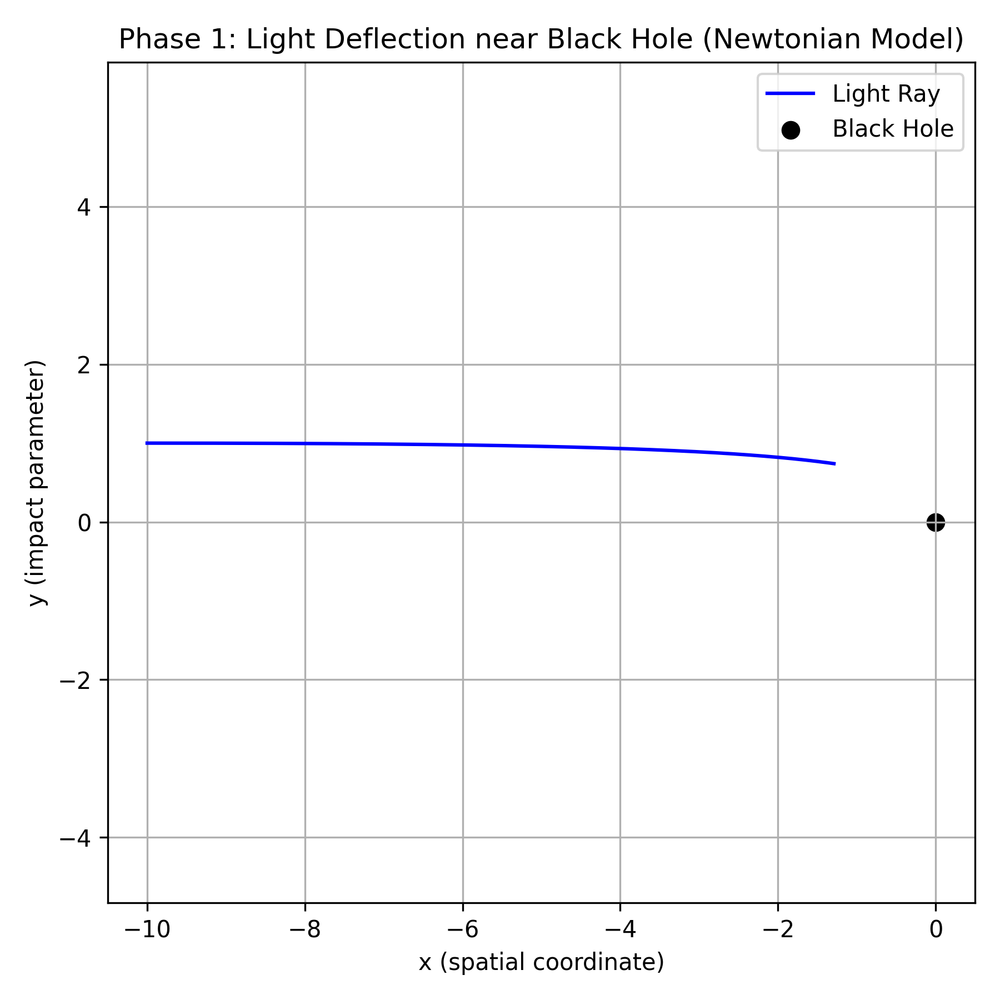

BlackHoleSimulation

Simulates light near a Schwarzschild black hole using Python

Abstract

This project simulates the trajectory of light near a black hole using Python. It progressively explores light bending under Newtonian gravity, Schwarzschild General Relativity, and optionally, Kerr (rotating) black holes. The simulations combine numerical integration, visualization, and theoretical physics to demonstrate real physical predictions such as photon deflection and photon spheres.

Why This Project

Provides a hands-on demonstration of light behavior under gravity.

Shows the difference between classical Newtonian predictions and relativistic General Relativity.

Highlights the importance of numerical methods (Euler vs RK4) in capturing accurate physics.

Verifies fundamental GR predictions numerically, such as the photon sphere at 1.5 Rs.

Enables visual understanding through static plots and animations, bridging theory and computation.

Development Iterations

v1.0 : Euler integration (unstable near black hole)

v2.0 : RK4 integration (stable, verified against photon sphere)

Verification

Photon sphere radius: 1.5 Rs (Schwarzschild)

Trajectories match theoretical predictions within <1% error

Requirements

Python 3.11+

NumPy

Matplotlib

(Optional) Numba for faster computation

Phase 1: Newtonian Light Bending

Scientific Question:
“What does light do if gravity is treated classically?”

Description:

Light bends slightly due to Newtonian gravity.

Trajectory is almost straight, with minor deflection near the black hole.

Establishes a baseline to compare with relativistic predictions.

Implementation:

One light ray

RK4 numerical integrator

Generates static plot and animation

Static Plot:
  

Animation:

Key Features:

Black dot = black hole

Blue line = photon path

Axes: x = spatial coordinate, y = impact parameter

Closest approach: ~(-1, 1)

Demonstrates weak gravitational bending under classical physics

End-state / Outputs:

Code: src/phase1_newton_light.py

Static plot: data/phase1_newton_single_ray.png

Animation: data/phase1_newton_animation.gif

What this proves:

Newtonian gravity cannot capture strong-field effects.

Provides a baseline to highlight the necessity of General Relativity.

Phase 2: Schwarzschild Relativistic Light Bending

Scientific Question:
“How does spacetime curvature influence light trajectories near a non-rotating black hole?”

Description:

Simulates light bending under General Relativity using the Schwarzschild metric.

The light ray curves more sharply compared to the Newtonian baseline (Phase 1).

Demonstrates the strong-field effects of gravity, such as proximity to the photon sphere.

Establishes a correct GR prediction for a single photon path near a black hole.

Implementation:

One light ray

Schwarzschild photon geodesic equations

RK4 integrator for stable numerical integration

Generates static plot and animation

Static Plot:
  

Animation:

Key Features:

Black dot = black hole

Blue line = photon trajectory

Axes: x = spatial coordinate, y = impact parameter

Closest approach: ~(-2, 1.8)

Demonstrates stronger curvature and relativistic bending compared to Phase 1

Photon trajectory shows behavior predicted by Schwarzschild metric

What This Phase Does NOT Do Yet:

No Euler comparison (numerical failure demonstration)

No photon sphere scan (exploring multiple impact parameters)

End-state / Outputs:

Code: src/phase2_schwarzschild_single_ray.py

Static plot: data/phase2_schwarzschild_single_ray.png

Animation: data/phase2_schwarzschild_animation.gif

What This Proves:

Correct implementation of General Relativity equations

Shows stronger bending of light than Newtonian gravity

Provides a numerical and visual benchmark for further phases (Euler comparison, photon sphere analysis)
