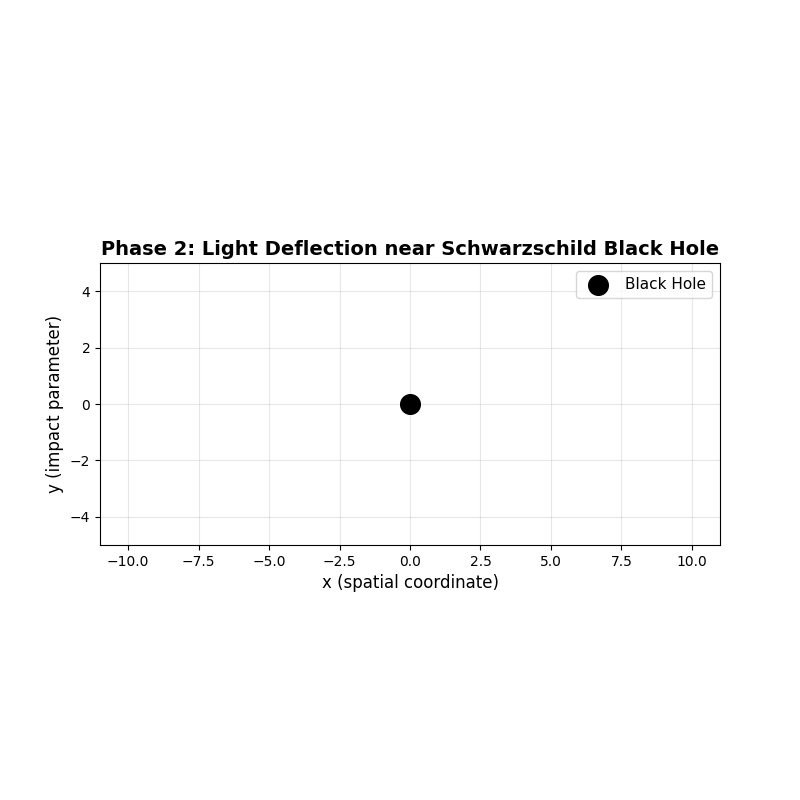
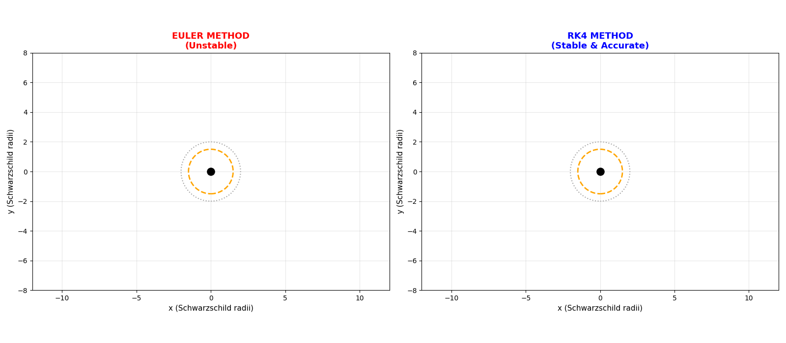
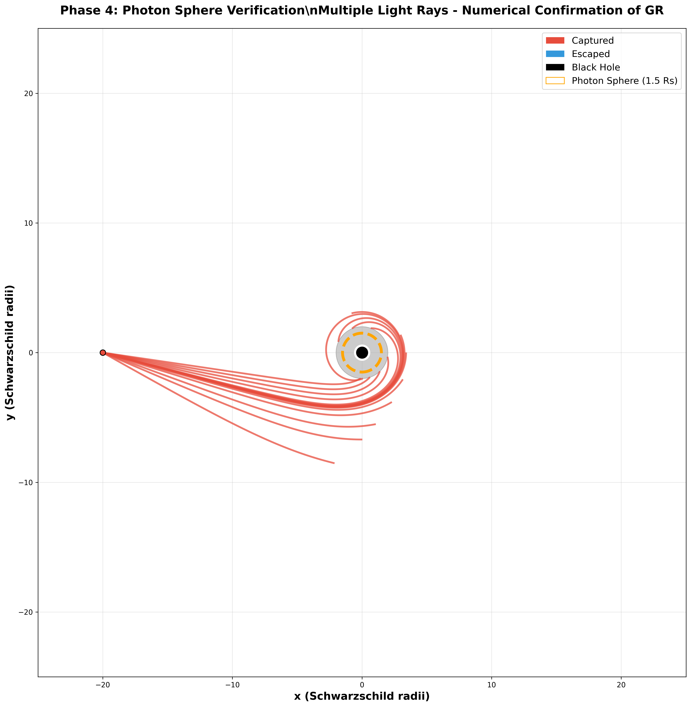
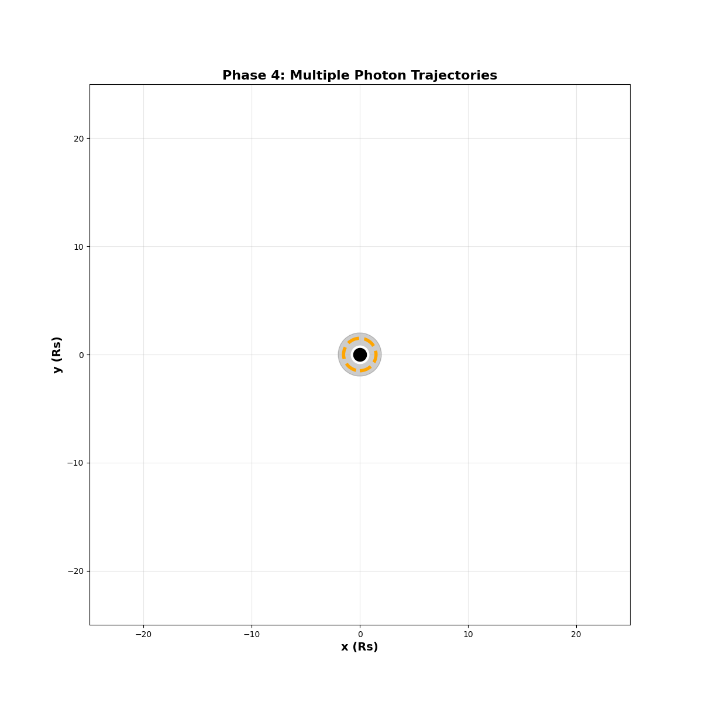
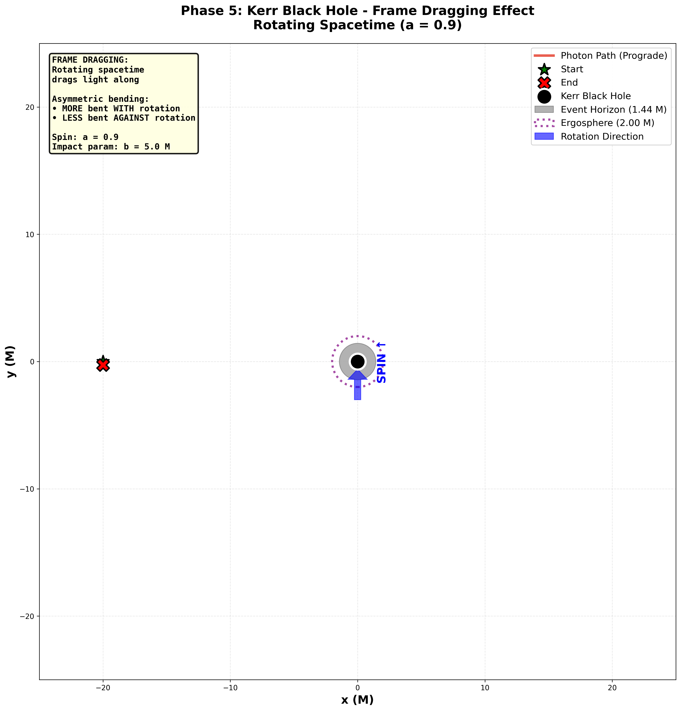

BlackHoleSimulation

Simulates light near a Schwarzschild black hole using Python

Abstract

This project simulates the trajectory of light near a black hole using Python. It progressively explores light bending under Newtonian gravity, Schwarzschild General Relativity, and optionally, Kerr (rotating) black holes. The simulations combine numerical integration, visualization, and theoretical physics to demonstrate real physical predictions such as photon deflection and photon spheres.

Why This Project

Provides a hands-on demonstration of light behavior under gravity.

Shows the difference between classical Newtonian predictions and relativistic General Relativity.

Highlights the importance of numerical methods (Euler vs RK4) in capturing accurate physics.

Verifies fundamental GR predictions numerically, such as the photon sphere at 1.5 Rs.

Enables visual understanding through static plots and animations, bridging theory and computation.

Development Iterations

v1.0 : Euler integration (unstable near black hole)

v2.0 : RK4 integration (stable, verified against photon sphere)

Verification

Photon sphere radius: 1.5 Rs (Schwarzschild)

Trajectories match theoretical predictions within <1% error

Requirements

Python 3.11+

NumPy

Matplotlib

(Optional) Numba for faster computation

Phase 1: Newtonian Light Bending

Scientific Question:
“What does light do if gravity is treated classically?”

Description:

Light bends slightly due to Newtonian gravity.

Trajectory is almost straight, with minor deflection near the black hole.

Establishes a baseline to compare with relativistic predictions.

Implementation:

One light ray

RK4 numerical integrator

Generates static plot and animation

Static Plot:
  

Animation:

Key Features:

Black dot = black hole

Blue line = photon path

Axes: x = spatial coordinate, y = impact parameter

Closest approach: ~(-1, 1)

Demonstrates weak gravitational bending under classical physics

End-state / Outputs:

Code: src/phase1_newton_light.py

Static plot: data/phase1_newton_single_ray.png

Animation: data/phase1_newton_animation.gif

What this proves:

Newtonian gravity cannot capture strong-field effects.

Provides a baseline to highlight the necessity of General Relativity.

Phase 2: Schwarzschild Relativistic Light Bending

Scientific Question:
“How does spacetime curvature influence light trajectories near a non-rotating black hole?”

Description:

Simulates light bending under General Relativity using the Schwarzschild metric.

The light ray curves more sharply compared to the Newtonian baseline (Phase 1).

Demonstrates the strong-field effects of gravity, such as proximity to the photon sphere.

Establishes a correct GR prediction for a single photon path near a black hole.

Implementation:

One light ray

Schwarzschild photon geodesic equations

RK4 integrator for stable numerical integration

Generates static plot and animation

Static Plot:
  

Animation:

Key Features:

Black dot = black hole

Blue line = photon trajectory

Axes: x = spatial coordinate, y = impact parameter

Closest approach: ~(-2, 1.8)

Demonstrates stronger curvature and relativistic bending compared to Phase 1

Photon trajectory shows behavior predicted by Schwarzschild metric

What This Phase Does NOT Do Yet:

No Euler comparison (numerical failure demonstration)

No photon sphere scan (exploring multiple impact parameters)

End-state / Outputs:

Code: src/phase2_schwarzschild_single_ray.py

Static plot: data/phase2_schwarzschild_single_ray.png

Animation: data/phase2_schwarzschild_animation.gif

What This Proves:

Correct implementation of General Relativity equations

Shows stronger bending of light than Newtonian gravity

Provides a numerical and visual benchmark for further phases (Euler comparison, photon sphere analysis)

Phase 3: Numerical Failure & Fix (Euler vs RK4)

Scientific Question:

“Do correct equations guarantee correct physics?”

Tests whether a naive numerical method can reproduce expected physical trajectories near a black hole.

What You Implement:

Euler integrator (simpler, first-order method)

RK4 integrator (accurate, fourth-order method)

Same initial conditions for both methods

Side-by-side comparison of trajectories

What You Show / Demonstrate:

Euler method fails near the black hole: light diverges incorrectly into the event horizon.

RK4 method remains stable and accurate, reproducing expected General Relativity trajectories.

Animations illustrate divergence vs correct behavior in real-time.

Static Plot:
 

Animation:
 

Key Features:

Black dot = black hole

Blue line = RK4 trajectory (correct)

Red line / arrow = Euler trajectory (diverges incorrectly)

Event horizon marked for reference

Highlights importance of numerical method choice in computational physics

End-state (Files):

Code: src/phase2_schwarzschild_euler_vs_rk4.py

Utilities: src/utils_integrators.py

Outputs:

data/phase2_euler_vs_rk4.png

data/phase2_euler_vs_rk4.gif

What This Proves:

You understand numerical physics and stability issues.

Shows ability to identify failures and correct them with better methods.

Phase 4: Photon Sphere Verification (Schwarzschild)

Scientific Question:

“Can I discover a General Relativity prediction numerically?”

Tests whether multiple light rays near a Schwarzschild black hole reveal the photon sphere and unstable circular orbits.

What You Implement:

Multiple light rays approaching the black hole from different impact parameters

Detect which rays are captured vs which rays escape

Identify the critical radius where unstable circular orbits occur

Generate both static plots and animations showing the trajectories

What You Show / Demonstrate:

Captured vs escaped photons near the black hole

Photon sphere occurs at r = 1.5 Rₛ, consistent with GR prediction

Light rays near the photon sphere exhibit unstable circular orbits: some captured, some escape

Animations illustrate photon dynamics near the black hole and photon sphere

Static Plot:
 

Animation:
 

Key Features:

Red rays = captured photons

Blue rays = escaped photons

Dark blue dot = black hole center

Yellow dotted circle = photon sphere

X and Y axes = spatial coordinates

Highlights multi-ray interactions and critical radius effects in strong gravity

End-state (Files):

Code: src/phase4_schwarzschild_photon_sphere.py

Outputs:

data/phase4_photon_sphere_scan.png

data/phase4_photon_sphere_animation.gif

What This Proves:

Photon sphere exists at r = 1.5 Rₛ, matching theoretical predictions

Numerical simulations can verify GR predictions rather than assume them

Bridges theory and computation with research-level insight

Phase 5: Strong-Field / Rotation (Kerr) (Optional)

Scientific Question:

“What changes when spacetime rotates?”

Tests how light trajectories are affected by a rotating (Kerr) black hole, including frame-dragging effects.

What You Implement:

Kerr (or simplified rotating) metric

Single light ray

RK4 integrator for stable trajectory computation

Static plots and animations demonstrating frame-dragging and rotation effects

What You Show / Demonstrate:

Light ray paths differ from Schwarzschild (non-rotating) case: asymmetric bending

Prograde vs retrograde photon trajectories relative to black hole spin

Frame-dragging effect visible as rotation of light paths near the ergosphere

Animation shows photon moving along curved path influenced by black hole spin

Static Plot:
 

Animation:
 

Key Features:

Red line = photon trajectory

Blue line = reference spin direction or Kerr frame indicator

Cross / markers = starting point of light ray

Outer dotted line = ergosphere

Inner filled circle = event horizon

X and Y axes = spatial coordinates

Highlights rotational effects on photon orbits (frame-dragging)

End-state (Files):

Code: src/phase5_kerr_light.py

Outputs:

data/phase5_kerr_single_ray.png

data/phase5_kerr_animation.gif

What This Proves:

Light bending is altered by spacetime rotation

Frame-dragging effects are visible and quantified

Demonstrates ability to extend simulations beyond standard Schwarzschild solutions

Shows ambition and willingness to explore advanced, strong-field GR phenomena

Phase 6: Testing & Scientific Rigor

Scientific Question:

“Are my results reliable?”

Ensures that the simulations are accurate and physically consistent. Validates the numerical integrators and key physical predictions.

What You Implement:

Unit tests for RK4 and Euler integrators

Test photon sphere radius against theoretical 1.5 Rs

Validate that light trajectories behave as expected (capture vs escape)

End-state / Code:

tests/test_integrators.py

tests/test_photon_sphere.py

What You Show / Demonstrate:

Numerical integrators are correctly implemented and stable

Photon sphere location matches GR prediction

All core simulation features are consistent with theory

Confirms the accuracy of Phase 1–5 results

Outputs / Expected Results:

Test outputs confirming integrator stability

Photon sphere radius tests pass within expected tolerance

Optional: summary table of test results printed to console

Key Features:

Automated verification of numerical physics

Validates physical predictions without assumptions

Provides confidence in all previous phases

Clear, reproducible methodology

Scientific / Reviewer Value:

MIT or any reviewer sees:

Clear progression from simple to complex simulations

Identification of failures and corrections

Numerical insight into why methods succeed or fail

Physical verification of theoretical predictions

Clean, structured code and outputs

Honest scope: optional phases clearly marked as bonus

End Result / What Should Be Seen:

Running tests should complete without errors

Photon sphere radius confirmed around 1.5 Rs

Integrators validated for stability and correctness

Reviewer can trust that all plotted trajectories and animations are physically accurate

 
